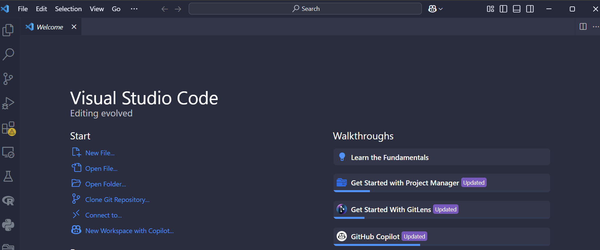
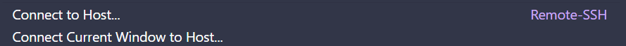
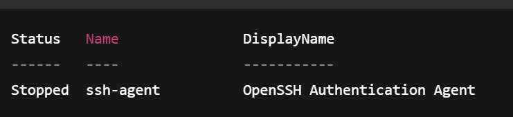
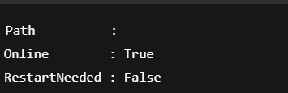

# Using SSH to Work Remotely on the GCE Server at Argonne

## (Windows Edition — for Personal Laptops)

---

## 1️⃣ Get Your GCE SSH Key and Account Set Up

1. Visit [https://accounts.cels.anl.gov/](https://accounts.cels.anl.gov/)  
   - Log in with your ANL credentials.  
   - Ask your mentor about which project(s) you need access to.

2. Open **Command Prompt** or **PowerShell** and run:

   ```powershell
   ssh-keygen -a 100 -t ed25519
   ```

   - Save the key to:

     ```
     C:/Users/youruser/.ssh/id_ed25519
     ```

   - Enter a passphrase when prompted.  
     ⚠️ **Remember your passphrase** — you will need it when using the key.

3. After generation, check your `.ssh` folder — you should see:

   - `id_ed25519` — *your private key* (keep this safe!)  
   - `id_ed25519.pub` — *your public key* (to upload to Argonne)

4. Copy your public key:

   ```powershell
   cat ~/.ssh/id_ed25519.pub
   ```

5. Go back to [https://accounts.cels.anl.gov/](https://accounts.cels.anl.gov/):
   - Go to **Account Information** → **Add Key**.  
   - Paste your public key.  
   - Add a short **Description** (example: `"My Laptop SSH Key"`).

---

## 2️⃣ Test Basic SSH Login

Run the following command (replace with your Argonne username):

```bash
ssh -J your_username@logins.cels.anl.gov your_username@homes.cels.anl.gov
```

- You should be prompted for your passphrase.  
- Answer **yes** to any first-time connection warnings.  
- If successful → you are now logged into GCE! 🎉

---

## 3️⃣ Setting Up SSH Config for VSCode Remote Work

### 3.1 Create SSH Config File

1. Navigate to your `.ssh` folder:

   ```powershell
   cd ~/.ssh
   ```

2. Create an empty `config` file:

   ```powershell
   type nul > config
   ```

3. Open the file in **Notepad**:

   - Right-click `config` → Open With → Notepad.

4. Add the following (replace with your username and key path):

   ```text
   Host login-gce
      User yourname
      IdentityFile C:/Users/yourpath/.ssh/id_ed25519
      Hostname logins.cels.anl.gov 
      LogLevel FATAL
      
      DynamicForward  1080

   Host homes-gce
	   User yourname
	   IdentityFile C:/Users/yourpath/.ssh/id_ed25519
	   Hostname homes.cels.anl.gov
	   ProxyJump login-gce
	
	   DynamicForward  1080
   Host compute-gce
	   User yourname
	   IdentityFile C:/Users/yourpath/.ssh/id_ed25519
	   Hostname compute-02.cels.anl.gov
	   ProxyJump login-gce

	   DynamicForward  1080
   ```

5. Save and close the file.
---

### 3.2 Connect with VSCode

1. Open **VSCode**.  
2. Click the **bottom-left green icon** → "Connect to Host".




3. Select:

   ```
   compute-gce
   ```


4. Follow prompts → enter your passphrase.  
5. Once connected:
   - Click **Open Folder**.  
   - Navigate to your GCE home directory and start working!

---

## 4️⃣ (Optional) Setting Up SSH Agent for One-Time Passphrase Entry

⚠️ You will need to do this **every time you reboot your computer**.

### 4.1 Start ssh-agent

```powershell
Start-Service ssh-agent
```

- If no error → you are good!  
- If you see an error → continue below.

### 4.2 Troubleshooting ssh-agent Errors

#### 4.2.1 Check ssh-agent Service State

```powershell
Get-Service ssh-agent
```

- If `Running` → skip next steps.  
- If `Stopped` or `Disabled` → proceed.

#### 4.2.2 Verify OpenSSH Installation

```powershell
Get-WindowsCapability -Online | Where-Object Name -like 'OpenSSH*'
```

- If `State : Installed` → good.  
- If `NotPresent` → install:

    ```powershell
    Add-WindowsCapability -Online -Name OpenSSH.Client~~~~0.0.1.0
    Add-WindowsCapability -Online -Name OpenSSH.Server~~~~0.0.1.0
    ```

    - If `RestartNeeded : True` → restart your computer.

#### 4.2.3 Enable ssh-agent Service

```powershell
Set-Service -Name ssh-agent -StartupType Manual
```

#### 4.2.4 Start the Service

```powershell
Start-Service ssh-agent
```

### 4.3 Add Your SSH Key to the Agent

```powershell
ssh-add ~/.ssh/id_ed25519
```

- You will be prompted for your passphrase.  
- Once added → your identity is loaded for this session.

---

## 6️⃣ What to Re-run After Every Reboot

⚠️ Every time you reboot your laptop, run:

```powershell
Start-Service ssh-agent
ssh-add ~/.ssh/id_ed25519
```

---

That's it — you should now be ready to work remotely on the GCE server using SSH from your Windows laptop! 🚀
